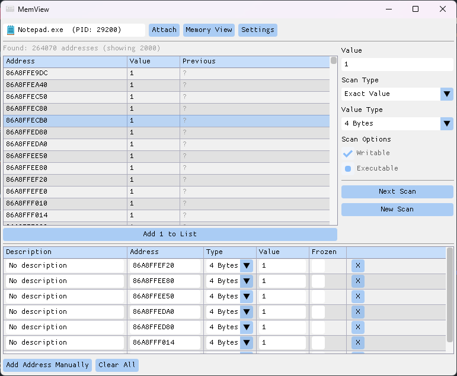

#  memview

A lightweight process memory scanner/editor for Windows.


[](license.md)

> memview is intended for learning, debugging, and inspecting
> processes you own or are authorized to analyze. Don't use it to tamper with
> software you don't have the right to modify. Because it reads and writes another
> process's memory, some antivirus / anti-cheat software may detect it.

## preview



## features

- **Memory Scanning** - first/next scan by value and type
- **Address List** - saved addresses with descriptions and types
- **Structure Dissector** - rebuild structures over memory, named from RTTI, exported as C++
- **Hex View** and **Disassembly** - live memory viewing with syntax highlighting
- **Regions** - a map of the process's memory regions
- **Modules** - a list of the process's loaded modules
- **Assembler/Disassembler** - edit instructions on the fly (asmjit + Zydis), NOP-fill
- **Signatures** - AOB signature generation
- **Symbols** - PDB symbols per module, from disk or symbol server

## requirements

- [CMake](https://cmake.org) and [Ninja](https://ninja-build.org)
- [Clang](https://releases.llvm.org) (clang/clang++)
- [vcpkg](https://vcpkg.io)

## dependencies

- [ImGui](https://github.com/ocornut/imgui) (Win32 + DirectX 11)
- [Zydis](https://github.com/zyantific/zydis)
- [asmjit](https://github.com/asmjit/asmjit) + [asmtk](https://github.com/asmjit/asmtk)
- [nlohmann/json](https://github.com/nlohmann/json)

## build

Clone with submodules:

```sh
git clone --recursive https://github.com/tihomirocrew/memview.git
```

Then build:

```sh
cmake --preset release
cmake --build --preset release
```
